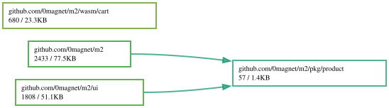

# m2

A single-binary web store server written in Go.

Runs [magnetosphere.net](https://magnetosphere.net) and
[cutemagnets.com](https://cutemagnets.com) — one codebase, one config file
per store.

## Features

- **Product catalog from a CSV file** — no database. Categories,
  subcategories, per-product pages, sitemap, and schema.org metadata are
  generated from the CSV at startup and reloaded when the file changes.
- **Stripe checkout** — payment-intent flow with a WebAssembly cart;
  live/test keys switchable from config.
- **WebAssembly frontend** — the cart (and any drop-in wasm apps you
  add, see "Custom wasm") are compiled at server startup, with both
  stdlib Go and TinyGo output.
- **Receipt printing** — orders print to a CUPS printer (`lp`).
- **ANSI-art logo** — `/logo` renders the site logo as ANSI art via
  `img2txt`.
- **Multi-store** — every site-specific string (name, domain, tagline,
  meta description, Telegram links) comes from the config file.
- Optional [cogentcore](https://cogentcore.org) UI (disabled with
  `NOCORE=true`).

## Requirements

- Go (and optionally [TinyGo](https://tinygo.org) for smaller wasm output)
- bash (config files are shell-sourced)
- `img2txt` (libcaca) and `ansifilter` for the ANSI logo
- CUPS (`lp`) if receipt printing is used

## Quick start

```sh
# generate a config template
go run . gen > mysite.conf

# edit mysite.conf: site name, Stripe keys, products CSV, ...

# create your product data (see products.example.csv for the schema)
cp products.example.csv products.csv

# run
MENV=mysite.conf go run . run
```

The store listens on `WEBPORT` (default 9883). Put a reverse proxy
(Caddy, nginx) in front of it for TLS.

## Deployment-local files

These are intentionally **not** in the repository; each deployment
provides its own:

| File / dir            | Purpose                                          |
|-----------------------|--------------------------------------------------|
| `<site>.conf`         | config incl. Stripe keys (`go run . gen` emits a template) |
| `products.csv`        | product data (`products.example.csv` shows the schema) |
| `img/`                | product images, favicons, card-brand icons; one image per product, named in the CSV `image1` column |
| `logo.png` `logo.jpg` `logo.svg` | site logo (`logo.jpg` is the source for the ANSI logo) |
| `content/font.css`    | optional web font, served inline at the top of `/style.css`; see `content/font.css.example`. Without it the site uses the browser's default monospace font. |
| `orders/`             | created at runtime; holds order JSON               |

## Customization

Everything below is config or drop-in files — no source edits needed:

- **Extra wasm apps** (e.g. a homepage animation): add drop-in source
  dirs under `wasm/` and list them in `WASMSRC`. The animation canvas
  and wasm script tags are only emitted for binaries listed there (the
  cart needs `'wasm/cart'` — keep that for checkout). Empty
  `WASMSRC=()` disables all wasm. See "Custom wasm" below.
- **Stock pages** (`/`-page About / Policy / Links sections): the repo
  ships `content/*.html.example` fallbacks. Create `content/about.html`
  (etc.) in your deployment to override them; those filenames are
  gitignored.
- **Web font**: create `content/font.css` (see `content/font.css.example`).
- **Site-specific endpoints**: drop-in `other.go` (next section).
- **cogentcore UI**: `NOCORE=true` disables the build and hides the
  header link to it.

## Custom routes

Site-specific endpoints live in an optional drop-in file `other.go`
(gitignored). Copy `other.go.example` to `other.go` and register any
routes your deployment needs — its `init()` appends a registrar to the
`extraRoutes` registry in `m2.go`. Deleting the file removes the routes;
no other code changes either way. Drop-in handlers are part of `package
main`, so they can use the config, templates, and product data directly.

## Custom wasm

Like `other.go`, wasm apps beyond the cart are deployment drop-ins.
Each entry in `WASMSRC` names a directory under `wasm/` holding a
`package main` compiled with `GOOS=js GOARCH=wasm` at startup. A
drop-in dir may be a self-contained Go module (its own `go.mod` +
`vendor/`) so its dependencies stay out of this repository; the build
runs from inside the directory either way. Pages emit a
`<canvas id='gocanvas'>` and script tags for every configured binary,
so a drop-in wasm can render on any page it recognizes by URL path
(magnetosphere.net uses this for its homepage animation and product-page
STL viewer, which are not part of this repository).

## Fonts

The site stylesheet uses the font families `mononokiregular` /
`mononokibold` with a `monospace` fallback. To use a custom font, create
`content/font.css` with `@font-face` rules for those families — see
`content/font.css.example`. No font files ship with this repository.

## Layout

```
m2.go core.go other.go order.go   server: routes, pages, orders, printing
cli.go                            cobra CLI + config (env via MENV file)
csv.go                            product CSV loading
tmpl.go                           template plumbing
htmpl/                            html/template files
content/                          static pages + site stylesheet
wasm/cart                         wasm sources compiled at startup (drop-in dirs welcome)
ui/                               optional cogentcore UI (NOCORE=true skips it)
vendor/                           vendored dependencies (committed)
```

## Static demo (GitHub Pages)

`demo/build.sh` builds a fully static mirror of the store into
`./public` using the demo config (`demo/demo.conf`), the example product
CSV, and placeholder images from `demo/img/`. Pages, categories, and product
pages all work statically; checkout does not (it needs the server). `.github/workflows/demo.yml`
builds and deploys it to GitHub Pages on every push to master — enable
Pages (Settings → Pages → Source: GitHub Actions) after forking.

Run it locally:

```sh
bash demo/build.sh
python3 -m http.server -d public 8000
```

## Running as a service

```ini
[Unit]
Description=example.com
After=network.target

[Service]
WorkingDirectory=/path/to/m2
Environment='MENV=mysite.conf'
ExecStart=/usr/bin/bash -c 'MENV=mysite.conf go run . run'
Restart=on-failure

[Install]
WantedBy=multi-user.target
```
## Dependency Graph

Made with [goda](https://github.com/loov/goda):

```
go run github.com/loov/goda@latest graph github.com/0magnet/m2/... | dot -Tsvg -o docs/m2-goda-graph.svg
```



## Lines of Code

Made with [gocloc](https://github.com/hhatto/gocloc) (excludes `vendor/`, `node_modules/`, `.git/`):

```
gocloc --not-match-d='(vendor|node_modules|\.git)' .
```

```
-------------------------------------------------------------------------------
Language                     files          blank        comment           code
-------------------------------------------------------------------------------
Go                              27            530            599           4404
HTML                            17             64             33            915
CSS                              2             22             22            361
Markdown                         3             35              0            170
YAML                             1              0              0            102
BASH                             3              5             18             71
Makefile                         1              8              0             19
XML                              1              0              0              8
TOML                             1              0              0              4
-------------------------------------------------------------------------------
TOTAL                           56            664            672           6054
-------------------------------------------------------------------------------
```
